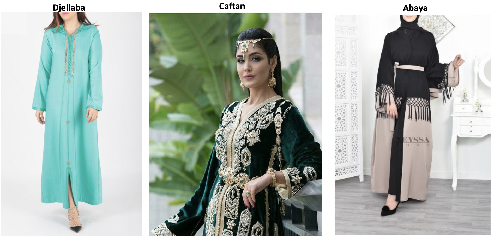

# Developing an AI application

In this project I implemented a model that classifies arabic clothes into 3 categories : Djellaba, Caftan and Abaya:

The images where taken from different sources mainly through a Google Image search, so all rights reserved to their respective owners.

The project is broken down into multiple steps:

* Load and preprocess the image dataset
* Train the image classifier on your dataset
* Use the trained classifier to predict image content

Here is the link to the colaboratory notebook version: https://colab.research.google.com/drive/1P819d-zo4D7f0T0U2ewB05gGDOdHTM8s

This code is inspired from GabrielePicco work on the Pytorch Challenge: https://github.com/GabrielePicco/deep-learning-flower-identifier
